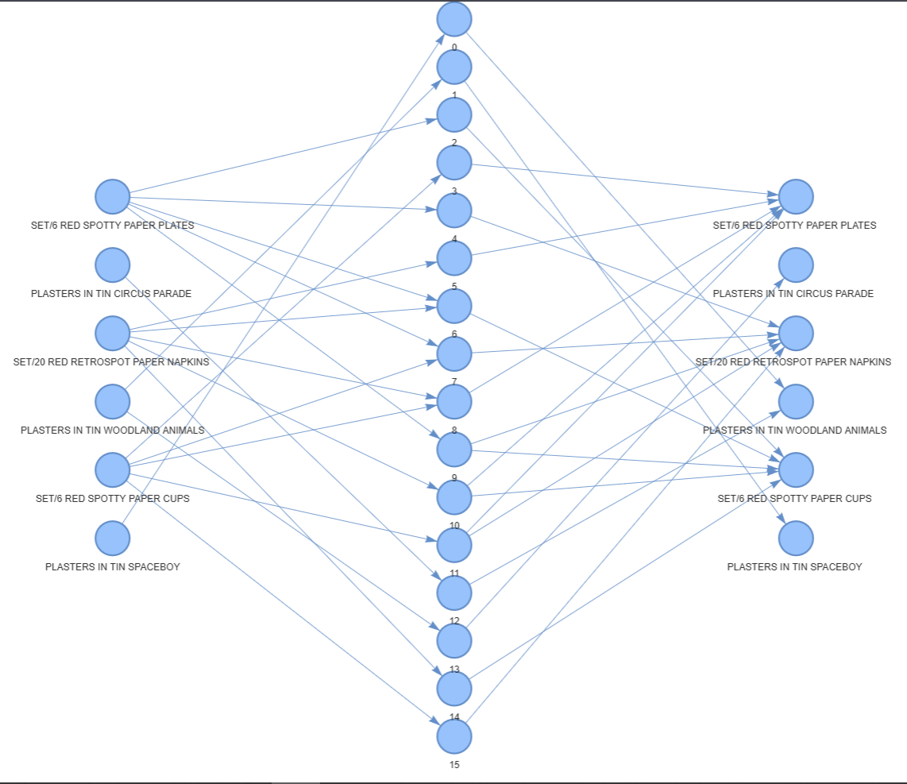

# Анализ рыночной корзины (ассоциативные правила)

## Описание проекта

Данный проект посвящен анализу рыночной корзины с целью выявления закономерностей в покупательском поведении.
Используя алгоритмы машинного обучения и визуализацию данных, мы исследуем частые наборы товаров и ассоциативные правила.

## Используемые методы и технологии:

- **Предобработка данных**: Очистка данных, удаление некорректных строк, преобразование данных в формат транзакций.
- **Генерация частых наборов (FP-Growth)**: Выявление наиболее часто встречающихся комбинаций товаров с использованием алгоритма FP-Growth.
- **Поиск ассоциативных правил**: Построение правил, описывающих взаимосвязи между товарами, на основе метрик поддержки и уверенности.
- **Визуализация правил (графы)**: Построение интерактивных графов для наглядного представления ассоциативных правил.

## Стек технологий:

- **Pandas**, **NumPy** — обработка и анализ данных.
- **Matplotlib** — построение графиков и визуализация результатов.
- **MLxtend** — реализация алгоритмов FP-Growth и поиска ассоциативных правил.
- **PyVis** — создание интерактивных графов для визуализации взаимосвязей.
- **IPython** — удобное отображение результатов в Jupyter Notebook.

